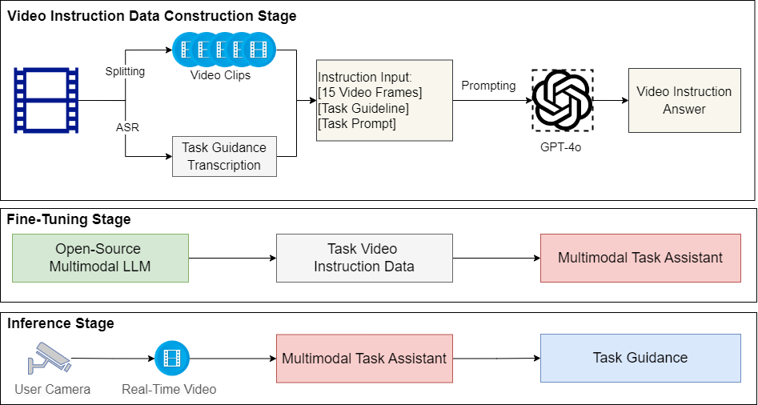
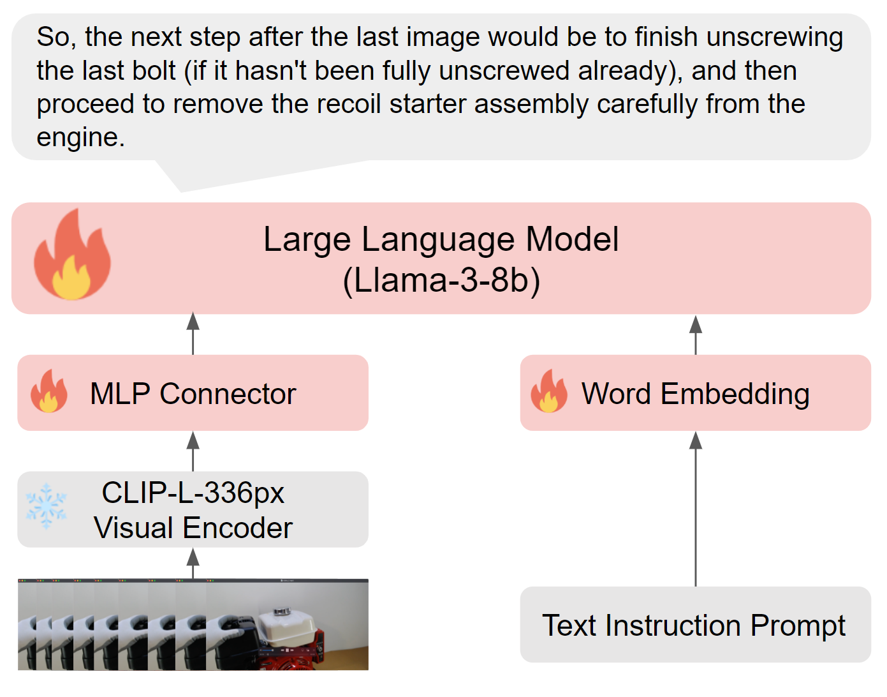

# LaViA: Fine-Tuning Multimodal LLMs as Task Assistants with Video Instructions

## Introduction

**LaViA**, Large Language and Video Assistant, is an AI prototype that demonstrates the possibility of leveraging multimodal LLMs to assist users in completing physcial tasks when they need help. It extracts knowledge from training video clips, augments it with manuals and additional knowledge sources, perceive the task execution, reason about the task state, and enable conversational guidance. The goal is to enable users to perform tasks by providing just-in-time feedback (e.g., identifying and correcting an error during a task, instructing users what is the next step, and answering their questions) and knowledge required to successfully complete tasks.

**LaViA** is powered by Multimodal Large Language Models (MLLMs). It takes task instructions and real-time video as input and tell you what is the right next step to perform on. It can also answer task-specific questions. With **LaViA**, you can quickly build up your own task guidance assistants.  While it can take advantage of annotations generated by GPT-4o, **LaViA** has a local vision/language model that can be deployed on premise, offering compelete privacy, data security and low inference cost. 

## LaViA

The framework of **LaViA** consists of three major steps: 
1. Video data preparation from real tasks; 
2. Instruction data construction with GPT-4o;
3. Video instruction tuning with multimodal LLMs.

<br>


### Video Data Preparation

The ideal video data for task guidance consists of demonstration videos that provide step-by-step instructions for task completion, accompanied by narrative explanation.

We considered 3 major video resources which satisfy our requirements:

1. Youtube Repairing Task Videos (Crawled Manually)
2. [YouCook2 Videos](http://youcook2.eecs.umich.edu/)
3. [WikiHow Videos](https://www.wikihow.com/Video)


### Video Instruction Data Construction
The instruction data generation pipeline consists of the following steps:

1. **Get Task Guidance Transcription via Speech Recognition**:
    We adopt the latest OpenAI-Whisper API to get the task instruction transcription from video narratives. The corresponding code, ``get_transctiption(),`` is located in the [data_construction.py](data_construction.py).

2. **Video Clip Split**:
   We adopt a frame sampling rate, in which we sample 1 frame every 30 frames from the video clip. We fix the parameter that each video instruction should contain 15 sampled frames. The whole video is split into a sequence of 450-frame length video clips for further annotation. 

3. **Action Annotation with GPT-4o**:
    We prompt the OpenAI GPT-4o API with the sampled sequential 15 video frames, the task guidance transcription, and the task prompt as the inputs. We enable GPT-4o to describe the current action/step shown in the video clip and then anaylyze and predict the next action/step to perform as guidance. The video instruction data is annotated as a json file. 


### Video Instruction Tuning
We provide a video instruction tuning codebase to fine-tune your own task guidance assistant. The codebase is available at [LaViA-video-sft](LaViA-video-sft/). Please refer to the [README file](LaViA-video-sft/README.md) for video instruction tuning guidance. 

<br>


## Inference on Task Guidance Generation
Our fine-tuned **LAVIA-llama-3-8b** model is available at 

If you would like to launch a LaViA server, please launch the gradio demo server.
```bash
cd LaViA-video-sft
CUDA_VISIBLE_DEVICES=0 python -m llava.serve.gradio_web_server --controller http://localhost:10000 --model-list-mode reload --share
```

### A Usage Sample
We start with a video sample from Youtube on a Honda Engine Oil Change task:

https://github.com/Victorwz/LaViA/assets/32738514/caa18f5e-f628-423c-bde3-e0516a8d34a6


<!-- [](https://www.youtube.com/watch?v=vmCyqhjMZjU) -->

```bash
export OPENAI_API_KEY="your_api_key"
python data_construction.py
```

The output guideline transcription and video instructions are available at [transcription](samples/honda_engine_oil_change_transcription.txt) and [instructions](samples/0_0.json).

## How to Cite Us

If you use our dataset or models in your research, please cite us as follows:

```bibtex
@article{wang2024LaViA,
      title={LaViA: Fine-Tuning Multimodal LLMs as Task Assistants with Video Instructions}, 
      url={https://github.com/Victorwz/LaViA},
      author={Wang, Weizhi and Luo, Xuan and Yan, Xifeng},
      year={2024},
}
```

## License
This project is licensed under the [CC BY-NC 2.0 License](https://creativecommons.org/licenses/by-nc/2.0/deed.en). Please refer to our work, i.e. mentioning our framework name, in your study or development.  Don't forget to give us a star if you find it is useful. 

## Acknowledgment
**LaViA** is led by Weizhi Wang at Xifeng Yan's lab @UCSB.  It is a part of the “Autonomous Multimodal Ingestion for Goal-Oriented Support” (AMIGOS) team directed by Dr. Charles Ortiz at PARC/SRI.  AMIGOS is funded by [DARPA Perceptually-enabled Task Guidance (PTG) program](https://www.darpa.mil/program/perceptually-enabled-task-guidance). 
